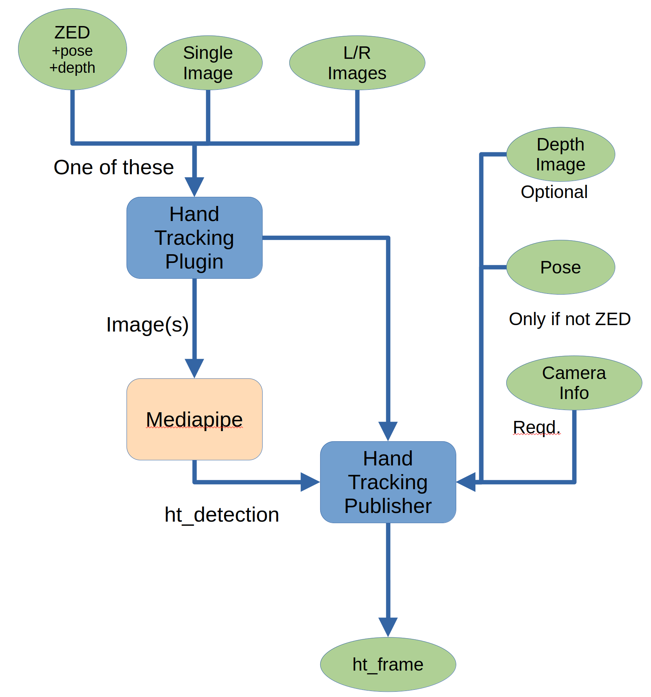

# ILLIXR Hand Tracking Plugin

This [ILLIXR][1] [plugin][2] computes hand points (joints and fingertips) of any hands (max 2) that are visible in the
input image(s). It utilizes the mediapipe [hand detection pipeline][3] to do the detection, then uses either supplied or
calculated depth data to determine the 3D position of each point in the reference space.

## Inputs

The hand tracking plugin takes a wide variety of inputs.

- image (required), single or left/right pair
- current pose (required)
- camera imformation (required) (see below) pertaining to the image(s)
- depth image (required for single image input, optional for left/right image pair)

## Outputs

The hand tracking outputs a single data type: ht_frame. The detections report positions of the following points

## Dependencies

This plugin has the following dependencies:

- abseil-cpp
- egl_headers
- farmhash
- fft2d
- flatbuffers
- gemmlowp
- neon_2_sse
- ruy
- pthreadpool
- XNNPACK
- tensorflow-lite
- protobuf (version 3.19)

All of these dependencies are packaged in the hand_tracking_dependencies repo, and are installed automatically (if
needed).

This plugin has the following dependencies which are provided by operating system repos:

- libcpuinfo
- libgles
- fp16

## Hand Tracking Process

The image below shows the hand tracking flow.

Here I will refer to the two plugin components as hand tracking plugin (_plugin_) and hand tracking publisher (
_publisher_)

1. When the _publisher_ starts up it gets the camera information from the [switchboard][4]
2. One of these is input to the _plugin_
    - ZED image (L & R images, pose, depth image)
    - Single (monocular) image
    - L/R image pair (binocular)
3. The _plugin_ takes the raw images and sends them to the mediapipe pipeline
4. The _plugin_ sends the raw images and any pose and depth information from the ZED to the _publisher_. (the raw images
   may not be necessary and may not be sent in the future)
5. The _publisher_ waits for output from the mediapipe pipeline
6. When the _publisher_ receives output it gets the current pose and depth images from the [switchboard][4] (this is not
   done if the input was from the ZED). A pose is required, but the depth image is optional, unless the input was a
   single image.
7. The _publisher_ iterates through the detected hand points
   a. converting them from percentage (of image size) to pixel
   b. using the depth and camera information the pixel values are converted to mm, relative to the camera's center (if
   no depth information is input, then the _publisher_ uses parallax calculations from the L/R images to determine
   distance)
   c. using the pose, these x, y, z values are converted to real-world coordinates
8. The _publisher_ sends a ht_frame to the [switchboard][4]

## Environment Variables

The hand tracking utilizes the following environment/yaml file variables to control its processing:

- _HT_INPUT_: the type of images to be fed to the _plugin_. Values are
    - zed
    - cam (for typical cam_type/binocular images)
    - webcam (single image)
- _HT_INPUT_TYPE_: descriptor of what image(s) to use. Values are
    - LEFT - only use the left eye image from an input pair
    - SINGLE - same as LEFT
    - RIGHT - only use the right eye image from an input pair
    - MULTI - use both input images
    - BOTH - same as MULTI
    - RGB - only a single input image
- _WCF_ORIGIN_: the pose of the world coordinate system as a string of 7 numbers denoting x, y, z, w, wx, wy, wz

## Download and Installation

This code should only be downloaded, compiled, and installed inside the [ILLIXR system][5] by enabling the hand_tracking
plugin.

[//]: # (- References -)

[1]:   https://illixr.org

[2]:   https://illixr.github.io/ILLIXR/glossary/#plugin

[3]:   https://ai.google.dev/edge/mediapipe/solutions/vision/hand_landmarker

[4]:   https://illixr.github.io/ILLIXR/glossary/#switchboard

[5]:   https://github.com/ILLIXR/ILLIXR
